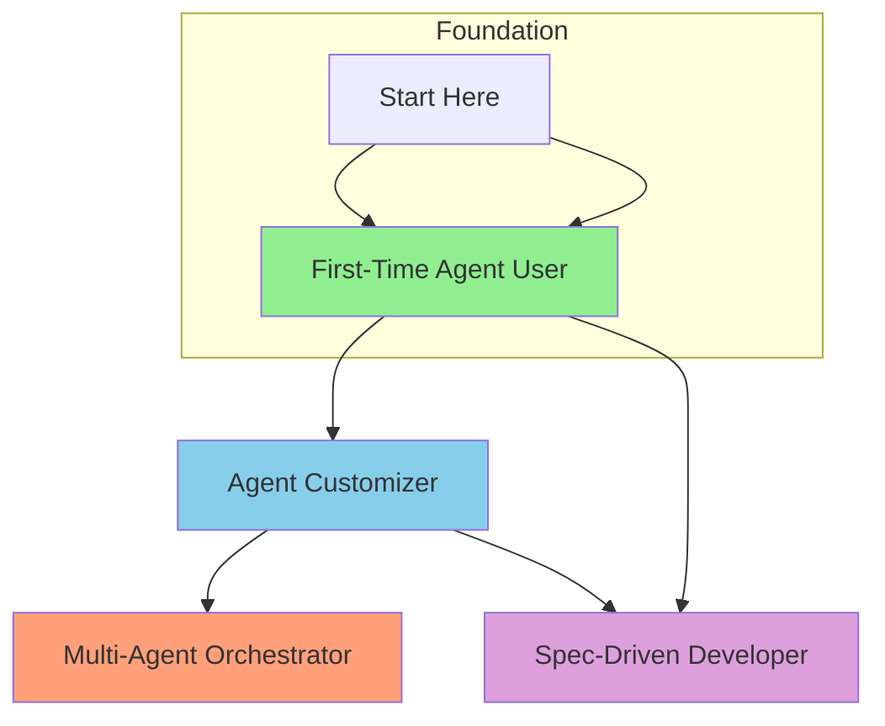

# Skill Tree

**Category:** learning
**Status:** active
**Added:** 2026-05-28
**Last verified:** 2026-05-28
**Tags:** meta, path, beginner, intermediate, advanced

## Description
Visual skill tree showing prerequisite relationships between all learning paths.

## Legend
| Color | Level | Path |
|-------|-------|------|
| 🟢 #90EE90 | Beginner | First-Time Agent User |
| 🔵 #87CEEB | Intermediate | Agent Customizer |
| 🟠 #FFA07A | Advanced | Multi-Agent Orchestrator |
| 🟣 #DDA0DD | Intermediate–Advanced | Spec-Driven Developer |

- **Start Here** → no prerequisites; begin with [First-Time Agent User](first-time-agent-user.md).
- **Agent Customizer** requires either [First-Time Agent User](first-time-agent-user.md) or equivalent experience.
- **Multi-Agent Orchestrator** requires [Agent Customizer](agent-customizer.md) or strong agent customization knowledge.
- **Spec-Driven Developer** can be entered from [First-Time Agent User](first-time-agent-user.md) or [Agent Customizer](agent-customizer.md).

## Related Pages
- [Learning Paths](README.md)
- [Master Index](../../index.md)
